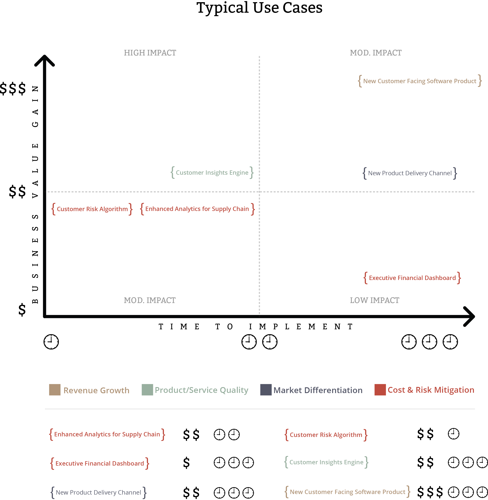

Preparación de un proyecto
========================================================
author: Adolfo De Unánue Tiscareño
date: 19 de Febrero, 2014
font-import: http://fonts.googleapis.com/css?family=Risque
font-family: 'Risque'
css: css/itam_big_data.css

¿Qué se espera de un proyecto de Analítica?
=======================================================

* Insights -> En tiempo real, *near real time*
* Impacto en 1 o 2 Qs
* Agile Big Data
  - Infraestructura
  - Modelado

Define tu caso de negocio
========================================================
Imagen de Infochimps

Define tu caso de negocio
========================================================
* ¿Cuál es la meta?
* ¿Cuál es la dirección a la cuál va la empresa?
* ¿Cuáles son los obstáculos para llegar ahí?
* ¿Quiénes son los *stakeholders*?
* ¿Cuál es el primer caso de uso Big Data que determinan los *stakeholders*?

Define tu caso de negocio
========================================================

- Determina el equipo del proyecto

  * ¿Quién es el *sponsor*?
  * Determina un líder de proyecto.
  * Establece la disponibilidad del equipo y las restricciones del proyecto.

Define tu caso de negocio
========================================================

Ejemplo

Concepto| Descripción
---------------------|------------------------
Executive Sponsor    |  Juanito
Objetivo de la Empresa | Mejorar las capacidades de ...
Piloto (Si/No - ¿Tiempo?) | Si (3 meses)
Presupuesto (Piloto/Producción) | 400,000 (Piloto) 1,500,000 (Producción)
Líder de Proyecto     | Pepe
Caso de Uso   | Prevención, Información, monitoreo
Criterio de éxito   | Mejores reportes, más rápidos, eficiencia...

Planea, planea
========================================================

* Especificar
* Metas en términos de negocio **medibles**
* ¿Preguntas de negocio?¿Líneas de investigación?
* Define como sería una implementación exitosa 
  - ¿Qué cambiaría?
* Establece un plan de trabajo con *milestones* a 1, 3, 6 y 12 meses.  

Técnicos
========================================================

* Ambiente
  - Todas las herramientas que usan
  - Arquitectura actual
  
* Fuentes de datos ¿Cuáles?
  - ¿Existentes?
  - ¿Compradas? ¿Descargadas?
  - ¿Adicionales?

Técnicos
========================================================
* Fuentes de datos ¿Qué?
  - Atributos prometedores, atributos existentes
  - ¿Vamos a unir fuentes?¿Qué problemas habrá?
  - ¿Los datos son compatibles con mis herramientas de modelado?
  - ¿Cómo manejamos los *missings*?

* Fuentes de datos ¿Cómo?
  - *Velocidad* ¿Cuánta se crea por unidad de tiempo?
  - *Variedad* ¿Qué tipos de datos?¿Catálogos / Esquemas en conflicto?
  - *Uso* ¿Inemdiata?¿Para uso futuro?

Técnicos
========================================================

Ejemplo

Nombre | Valor
-------------------|---------------------
Fuente de datos | Descripción
Escuchador / Conector | HTTP, Streaming, Batch, Syslog
Atributos / Campos  | 
Tipo de dato (JSON, XML, CSV, SQL, etc.) |
Velocidad (Eventos / segundo) |
Factor de crecimiento (1yr) |
Tamaño promedio de evento |
Time to action |

Técnicos
========================================================

* ¿Quiénes?
  - Usuarios que trabajarán con los datos
  - Habilidades
  - ¿Se requerirá entrenamiento?
  - ¿Qué herramientas se necesitarán para analítica, visualización, etc?
  

Técnicos
======================================================

Ejemplo

Nombre | Valor
--------------|----------------
Usuario Final | DS, DE, DA, BA, Estadístico,Ejecutivo
Herramienta de Usuario Final | Hive/Hue, SQL Server, Cognos, Excel, R...
Actividades de análisis | *Queries* exploratorios, Reportear, Modelar, *Mashups*

Valor
=======================================================

- **Time to business value**
- Facilidad de uso
- Escalabilidad
- Basado en estándares
- Capacidad actual de la empresa para adopción *Enterprise Readiness*
- **3 year Total Cost of Ownership**

Extras
=======================================================

Además de las tablas anteriores...

* Costo Estimado

Categoría | Descripción | Costo inicial | 3yr TCO
---|-----|-----|----
Personal|
Software|
Hardware|
Capacitación|
Consultoría|
Time to Value |

Extras
=======================================================

* Entregables

Nombre | Descripción | Timing
----|-----|-----
Plan de Trabajo |
Especificación de Infraestructura |
Especificación de Implementación |
....|

Extras
=======================================================

Por último, agreguen:
  - ** Dependencias ** (Incluyan diagrama de impactos)
  - ** Suposiciones ** (Súper claras!)
  - ** Restricciones ** (*Idem*)
  
  
 
=======================================================
type: exclaim

# Arquitecturas
# de Ejemplo
