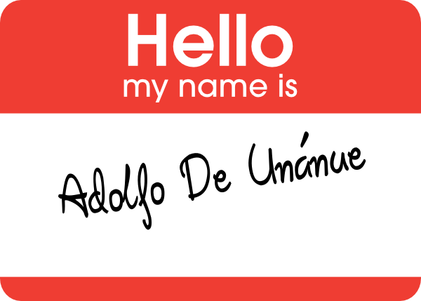

Proyectos 
========================================================
author: Adolfo De Unánue T.
date: 15 de Enero, 2014
font-import: http://fonts.googleapis.com/css?family=Risque
font-family: 'Risque'

Presentación
=======================================================
type: sub-section
 

¿Quién?
========================================================

¿Quién?
========================================================

- Chief Data Scientist @ OPI - Open Intelligence
- Trabajo anterior: Data Scientist @ Sm4rt Predictive Systems
- Doctorado, MC^2

¿Qué es este curso?
============================================================
- En este curso quiero exponerlos a un proyecto **real** de ciencia de datos.
- *Ergo* es un curso completamente *hands-on*.
- La entrega final del proyecto es la única calificación.
- No hay tareas, hay avances.
- Desconozco el resultado final de los proyectos.
- Mi función será de *couch* (usando terminología de `XP`)
  - *La metodología, no el sistema operativo*.

¿Qué es este curso?
============================================================
- Todo el proyecto se realiza en `github`.
- Mándenme su `username` de `github` y los agrego al proyecto.
  - Los que ya lo hicieron, no es necesario.
- Tiene que quedar el proyecto con el código, avances, presentaciones, visualizaciones.
- Es por equipos, presentaciones, círculos de discusión.

Objetivo
============================================================
type: alert

- Publicar todos los proyectos en revistas o conferencias.

Proyectos
===============================================================
type: section

Minando al Poder Legislativo
=========================================================
type:sub-section

Proponentes: Luis Godoy / Adolfo De Unánue

Descripción
========================================================

- En los diarios de debate se encuentra casi toda la información necesaria para conocer a detalle las legislaturas y por tanto las leyes:
  - Votaciones nominales, diputados que integran comisiones, líderes de comisiones y mesas directivas, 
  - Número de diputados reelectos, leyes aprobadas, leyes no aprobadas, número de enmiendas a una ley, etc. 
- Se pueden descubrir muchos patrones al analizar estos datos no estructurados, es texto crudo disponible para inferencias. 
 - `http://cronica.diputados.gob.mx/DDebates/`
 
Objetivos
========================================================
- Organizar estos datos también es transparencia. 
- La apertura de datos sólo ha sido un esfuerzo que se ha concentrado en el Ejecutivo 
- ¿Será posible presionar al Legislativo a través de métodos de inteligencia artificial y estadística avanzada? 

Tópicos
========================================================
- Datos no estructurados
- Minería de texto
- Análisis semántico
- Transparencia y *Open-data*

 
¿Conciencia Global?
=========================================================
type:sub-section

Proponentes: Adolfo De Unánue

Descripción
========================================================

- Esto puede sonar muy raro, pero... 
- *We collect data continuously from a global network of physical random number generators located in up to 70 host sites around the world at any given time. The data are transmitted to a central archive which now contains more than 15 years of random data in parallel sequences of synchronized 200-bit trials every second.* 
- `http://noosphere.princeton.edu/`

Objetivos
========================================================

- Analizar sus datos y quedar conectado para analizarlos contínuamente.
- Preparar la infraestructura.
- Definir y comprobar sus conclusiones.
- Eliminar la charlatanería es muy importante.

Tópicos
========================================================

- Infraestructura contínua
- Estadística bayesiana
- Minería para patrones y correlación de varias bases de datos
  - Para obtener los eventos
- Information retrival

Espionaje histórico
=========================================================
type:sub-section

Proponentes: Adolfo De Unánue

Descripción
========================================================

- Palantir tiene filosofías interesantes y muchos productos, en particular analizan datos de muchas fuentes y luego presentan grafos con los cuales infieren cosas. 
  - Debido a su filosofía de *Data Mining/Machine Learning*.
- Haremos lo mismo con Wikipedia. Esa es nuestra base de datos de inteligencia.
- Tiene todo: Lugares, fechas, relaciones, personajes, etc.

Objetivo
========================================================

- Generar grafos que cuenten una historia ¿Es posible usar este tipo de herramientas para explicar eventos futuros?
- ¿Cómo visualizo la información? ¿Cómo la reporto? ¿Cómo cuento la historia?
- ¿La memoria presenta en realidad problemas futuros? 

Tópicos
========================================================

- Information retrival
- Graph analysis
- Visualization
- Storytelling

Luces de la ciudad
=========================================================
type:sub-section

Proponentes: Adolfo De Unánue

Descripción
========================================================

- Hay muchas bases de datos geoespaciales que incluyen densidad poblacional, 
crecimiento, pobreza,impactos ambientales, etc.
- Y la NASA tiene además las bases de datos relacionadas con luminosidad del mundo a nivel nocturno.
- Existen muchas teorías sobre si estas luces son un *proxy* para pobreza o subdesarrollo.
¿Será cierto?

Objetivo
========================================================

- Obtener los datos espaciales y hacer el análisis necesario para responder preguntas como 
la recién mencionada.

- Otras preguntas interesantes son si hay correlación con violencia en algunas zonas, 
eventos, cambio climático, consumo de recursos, etc.

Tópicos
=========================================================

- Análisis geoespacial
- Impacto Ambiental
- Minería de datos

Q & A
======================================================

- ¿Vamos a publicar?
  - Es el objetivo, es una clase con la intención de colocarlos en el mapa.

- ¿De verdad no sabe el resultado de esto?
  - Es verdad, son cosas que siempre me han dado curiosidad

- ¿No es eso muy riesgoso?
  - Sí y mucho, pero si están de acuerdo, va a ser muy interesante
