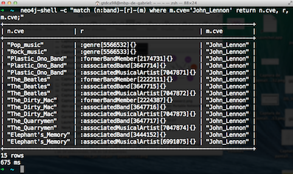

Reporte de Proyecto Espionaje Histórico
=====================================================

**Alfredo Garbuno Iñigo**

**José Iván García Rosales**

**Gabriel Tadeo del Campo Aceves**

## Introducción
La motivación de este proyecto se deriva de [Palantir](http://www.palantir.com/) una organización que se especializa en el análisis de información recolectada de distintas fuentes y presentada con grafos. Esto con el fin de poder mejorar la capacidad tanto predictiva como analítica de sus especialistas.  

En este contexto surge la idea tanto de analizar información de manera gráfica como de estructurarla en forma de grafo. La fuente de información será la enciclopedia en línea Wikipedia y buscaremos patrones muy particulares para cada tema de interés para el usuario. 

## Problema de Negocio
El problema que se quiere atacar es el de buscar relaciones en la información de la enciclopedia que sirva para trazar patrones, predicciones o semejanza entre distintos objetos de estudio para un usuario. Es decir, dada la solicitud del usuario definida como un conjunto de temas, lo que se quiere es proveer de una visualización que permita trazar relaciones entre los distintos temas. Para esto se utilizará la Wikipedia completa y se aprovechará la estructura que presentan los documentos de la enciclopedia para encontrar dichas relaciones. 

En este sentido será necesario realizar un análisis semántico del contenido de cada documento de *Wikipedia* para poder determinar propiedades útiles de cada uno. La relación establecida a través de los hipervínculos de las páginas *web* de los temas serán útiles para poder trazar las relaciones entre temas de manera que queden expresadas en un grafo, para posteriormente pasar a un análisis propio de Aprendizaje Automático para poder realizar las estimaciones apropiadas y obtener un subgrafo que permita al usuario entender mejor su conjunto de temas.

El proyecto consiste en tres grandes fases. 
  * Obtención y transformación de los datos.
  * Carga y exploración en una base de datos adecuada.
  * Explotación y visualización de la información bajo modelos de minería de datos en grafos.

Por simplicidad y dado el trabajo y esfuerzo que se ha recibido el proyecto de *DBpedia* se consideró tomar esto como fuente de datos. Entendiendo las ventajas y desventajas de dicho proyecto. Es por esto que la primera fase del proyecto se reduce a considerar al proyecto de *DBpedia* como fuente de información y analizar la capacidad necesaria en nuestra base de datos. 

En un siguiente paso se ha determinado que la base de datos mas adecuada para poder albergar la información de dicha fuente será `Neo4j`. Dicha base de datos orientada a gráficas la cual posee tanto una estructura como un lenguaje de consultas que resultan ser mas adecuados a los propósitos de este proyecto.

Para la exploración y visualización se consideraron diversas herramientas que en un principio prometían ser capaces de conectarse a la base de datos. Al final utilizamos como motor de análisis el paquete estadístico `R`, en particular la biblioteca `igraph` diseñada para el análisis de redes. Para el despliegue de grafos resultó atractiva su conectividad con la librería de JavaScript `d3.js`. Otro factor que afectó la decisión por optar por `R` fue la librería  `shiny` que permite desplegar una interfaz web interactiva con la cual se pueden manipular los datos y desplegar reportes.

## Fuentes de Datos
Como se ha mencionado previamente la información originalmente se pretendía descargar de los repositorios de *Wikipedia*. Los cuales se distribuyen en *dumps*. Estos archivos previamente se encontraban en formato sql. Sin embargo a partir del 2005 fueron reestructurados para manejarse en XML's. En términos globales la información vigente contenida en los *dumps* de *Wikipedia* febrero de 2013 consistía en alrededor de 40 GBs de memoria, sin incluir información de usuarios e histórico de charlas. La historia completa pesaba alrededor de 10 Tb de información. Dichos archivos están disponibles en formato .bz2 debido a que es el formato mas estable y fácil de verificar su integridad en las transacciones. 

Sin embargo existen ya varios proyectos que han trabajado con la información de *Wikipedia*. Esto es para poder brindar estructura a información que naturalmente no es estructurada. Dichos proyectos se basan principalmente en técnicas de procesamiento de lenguaje natural, NLP por sus siglas en inglés. Dentro de estos proyectos destacan `Freebase`, `Yago` y `DBpedia`. Las diferencias radican en los objetivos, fuentes y esquemas con los que trabaja cada uno de estos dos proyectos. En particular `Freebase` destaca por utilizar información de otras fuentes de tal forma que puedan complementar lo que se logra extraer de los archivos de *Wikipedia*. Sin embargo el proyecto de `DBpedia` es un proyecto que recibe apoyo económico de varias organizaciones y `Freebase` es un proyecto financiado por *Google*. Esto hace mas atractivo utilizar la base de datos de `DBpedia` pues principalmente su desarrollo corre gracias a *software* abierto. Por ejemplo, los datos de `Freebase` se guardan en un repositorio privado mientras que los datos de `DBpedia` se encuentran en repositorios de terceros. De manera equivalente el lenguaje utilizado para poder explotar de manera directa los datos es a través de un *endpoint* de SPARQL en cuanto a `DBpedia` y a través del API MQL propio del equipo de desarrollo de `Freebase`. 

Particularmente `DBpedia` construye su información a través de los metadatos de los archivos de *Wikipedia* como son ciertas propiedades o etiquetas. Incluso hereda de *Wikipedia* la estructura de ligas entre artículos de la enciclopedia lo cual genera de manera natural los nodos y arcos que se necesitan definir en grafo. En la manera en que se guarda la información en los repositorios de `DBpedia` es a través de tripletas. Donde la primera entrada define el sujeto, la segunda el verbo y por último el predicado. De tal forma que podemos observar diversos patrones como por ejemplo

```
sujeto_1  tipo_propiedad_j  valor_propiedad_k
```
Donde se lee que el individuo *i* tiene la propiedad *j* con el valor *k*. Sin embargo dicha construcción también sirve para hablar de las ligas entre los nodos. Como son 
```
sujeto_1 ligado_a sujeto_2
```
Donde de manera análoga se pueden establecer las relaciones entre los artículos de la enciclopedia. Por otro lado, un punto a favor del proyecto de `DBpedia` es la incorporación de los datos contenidos en los *infoboxes* en la construcción ontológica de las tuplas. 

De esta manera tenemos que la información obtenida directamente del proyecto de `DBpedia` está construida a partir de conceptos simples y sus unidades de información quedan estructuradas de la siguiente forma:
* Cada elemento (Sujeto)  es diferenciable a través de su URI, y por él se puede identificar su fuente. El URI (Uniform Resource Identifier) está formado por la integración de dos elementos URL (Uniform Resource Locator) y URN (Uniform Resource Name)
*  Existen datos – denominados Propiedades – y representan información que otorga atributos a los sujetos 
* Se cuenta con elementos de análisis que reflejan la relación o enlace entre dos sujetos, estos se denominan  Predicados. 
* Dadas estos elementos es posible identificar dos tipos de información ontológica fundamental

```
a) Sujeto – Propiedad - Valor
```
Cada elemento de análisis esta clasificado en un árbol de categorías y dentro de la categoría posee propiedades que lo distinguen.

```
S= <http://dbpedia.org/resource/Alabama>   
C= <http://dbpedia.org/ontology/areaTotal>      
P= "1.35765E11"^^<http://www.w3.org/2001/XMLSchema#double>    
```
```
b) Sujeto – Predicado – Objeto
```
Los sujetos tienen relaciones (actos) sobre Objetos los cuales corresponden a su vez a otros sujetos.

```
S= <http://dbpedia.org/resource/Aristotle>    
P= <http://dbpedia.org/ontology/influencedBy>     
O= <http://dbpedia.org/resource/Heraclitus>   
```

¿Cómo se va a manejar la información de `DBpedia`? El análisis se realizará de manera local, en lugar de solicitar información al desarrollador o a tercero es importante la consideración de una base de datos capaz de lidiar con datos con estructura de Grafos. Dentro de las posibles soluciones al problema se encuentran Neo4j, Titan, OrientDB o ElasticSearch. Dentro de estas opciones, la base de datos más utilizada es [Neo4j](http://db-engines.com/en/ranking/graph+dbms) seguida de Titan u OrientDB. Por otro lado ElasticSearch parece ser una base de datos que no parece haber sido desarrollada para tratar con datos de esta naturaleza. Dentro de las fortalezas de Neo4j sobre las demás es que su versión individual es de acceso libre, por otro lado es fácilmente escalable a través de la versión corporativa. Es una base de datos fácilmente manejable a través de Java. Se pueden crear índices tanto en nodos y propiedades como en los arcos mismos de la gráfica. De igual forma incluye un dashboard que puede ser consultado de manera local o vía remota en un explorador dónde se pueden realizar tareas de mantenimiento y/o consulta. Por último, `cypher` el lenguaje con el que se realizan consultas a la base es muy similar al SQL sin embargo es muy sencillo de aprender y hay tutoriales sobre éste en la página oficial. 

##Base de datos. Neo4j
Los requerimientos de información para la integración de datos en Neo4j que debemos tomar en cuenta son:  

*	Los nodos deben estar asociados a una clave única diferenciadora. Durante el proceso de carga Neo4j asigna un número de nodo a cada elemento que se integra (consecutivo irrepetible). Esto lo hace con independencia que el valor asociado ya se encuentre registrado previamente. A partir de la versión 2.0 es posible asignar llaves propias de indización.
*	Adicionalmente,  los nodos reciben la asignación de propiedades que a su vez son base  en la definición de consultas.
*	Un conjunto de nodos previamente constituidos pueden asociarse a categorías que segmentan la información por tipo. Estas categorías también llegan a integrar  índices de consulta.
*	Los arcos (dirigidos o no)– denominados relaciones en Neo4j – poseen: un identificador numérico, dado por el sistema, una etiqueta asociada que ‘verbaliza’ la relación  y de forma opcional reciben la asignación de propiedades del mismo modo que los nodos. 
*	Todo elemento de carga debe efectuarse indicando inequívocamente el nodo al cual se asigna la propiedad, etiqueta o relación.


##Formato de datos  

La información de `DBpedia` como hemos mencionado anteriormente es producto de un proyecto de extracción de contenido de Wikipedia. Sus fuentes se encuentran disponibles en dos formatos generales: Listado y Bases Ontológicas. 

* *Listados.* Reflejan la relación ontológica (S- Pr -V o S-P-O). Constituidos por tripletas en diversos idiomas y segmentados por formatos de contenido (imágenes, textos, enlaces, etcétera) 
* *Bases ontológicas.* Conjuntos de información donde la relación muestra los Sujetos por renglones, los Predicados/Propiedades en los encabezados de las columnas y, los Objetos/Valores en la intersección de ambos.  Los formatos disponibles están en inglés en CSV y JSON .

Para la consulta de información, estos formatos pueden descargarse a diversos niveles de agregación. Las opciones  van desde la versión ontológica completa  hasta la consulta de una subclase específica como lo es la etiqueta luchadores de sumo.  Para información detallada sobre la disponibilidad de la informacion de DBpedia consúltese http://mappings.dbpedia.org/server/ontology/classes/ .

En particular utilizamos la versión ontológica de `DBpedia` en Base CVS ya que esta, en comparación con las otras fuentes DBpedia, permite la generación de nodos y arcos en forma independiente conservando la integridad relacional sin altos requerimientos de procesamiento 

El uso de listas se considero débil para la construcción de relaciones en `Neo4j`. La asociación de tripletas pertenecientes a fuentes diversas se traduce en la identificación de claves de identidad homogéneas en Sujetos y Objetos.

En cuanto al uso de base en formato JSON se consideró inviable dado que la construcción de bases de datos a partir de este formato en `Neo4j` representa la integracion plena de la base via memoria en un solo paso. Dado el volumen de procesamiento resultan evidentes los  problemas de desempeño aunados a limitaciones técnicas de los equipos de cómputo. Además con regularidad se reconocen problemas memoria en el procesamiento de datos en aplicaciones basadas en Java.   

## Fuente de datos utilizada
Como se señaló, existen segmentos de la base ontológica de `DBpedia` a diversos niveles (clases) dependiendo del interés del usuario. 

La clase general de la base ontológica es `Thing` y a ella pertenecen  clases  como `Activity`, `Agent`, `Event`, `Biomolecula`, `Anatomical Structure`, `Award`, `Device`, `Place`, `Polyhedron`, `Tropical Concept` etc. A su vez, cada una de estas puede estar subdividida en clases que permiten mayor detalle en el análisis. En total la base `Thing`  cuenta con 656 ramificaciones ontológicas.

No todas las ramas fueron consideradas objeto de estudio del presente. Esto obedece tanto a criterios de relevancia como razones viabilidad del proyecto. 

Adicionalmente debemos reconocer que `DBpedia` refleja el contenido de Wikipedia y en consecuencia hereda temáticas no propias del estudio. Por ejemplo, la clase `Activity` se refierenexclusivamente a deportes y es redundante con la información que se localiza en la clase `Agent` subclase `SportLeague`.


Para los fines del presente se consideraron únicamente tres clases: **Agent**, **Event** y **Place** que a su vez se subdividen en 245, 36 y 131 subclases respectivamente. Las fuentes de información se localizan [aquí](http://web.informatik.uni-mannheim.de/DBpediaAsTables/DBpediaClasses.htm).   

**Fuentes  utilizadas**  

Archivo     |      Tamaño    | Registros   | Campos 
-----------|:---------------|:-----------|:-----------|
Agent.csv  |  7,100,209,857 | 1,041,033  |  836 |   
Event.csv  |    886,661,600 |    38,469  | 2,969  |   
Place.csv  |  3,409,549,881 |   639,454  |  621   |
 
*Los campos no muestran valor para la totalidad de los registros. * 
 
**Estructura de archivos**  
Abordemos ahora la estructura de los archivos, reconociendo en ellos los conceptos que repasamos anteriormente. Se acompaña un ejemplo de la clase ontológica Agent.

Conservemos en mente dos ideas básicas 
```
1. En cada archivo existen 4 encabezados para cada campo.  
   * Etiqueta de propiedad que equivale al nombre de campo  
   * Expresión URI del primer encabezado  
   * Tipo de variable 
   * Expresión URI del tercer encabezado 
```

```
2. Cada registro muestra en su primer columna el URI del Sujeto al cual se refiere el contenido de todo el renglón.  
```

**Identificación de contenidos**  
Veamos como se muestran en los archivos planos CVS las expresiones **S-P-O** y **S-Pr-V** .

*Sujeto – Predicado – Objeto*

Cada  expresión ontológica  **Sujeto – Predicado – Objeto** se define en campos contiguos que se refieren al mismo campo.  La primera columna define la tipología del dato, la segunda el valor; ejemplo:

```
Archivo Agent.csv
```

* Campos 5 (Encabezados)  
(1) "academicAdvisor_label"  
(2) "http://dbpedia.org/ontology/academicAdvisor"  
(3) "XMLSchema#string"  
(4) "http://www.w3.org/2001/XMLSchema#string"  

* Campo 6 (Encabezados)  
(1) "academicAdvisor"  
(2) "http://dbpedia.org/ontology/academicAdvisor"  
(3) "Person"  
(4) "http://dbpedia.org/ontology/Person"  
  

El campo 5 indica que los valores asociados representan cadenas de texto –string-. Estos contenidos en el esquema se identifican con una clase de dato especifica: academicAdvisor. El campo 6 indica que los objetos referidos en la columna corresponden a la clase ontológica Person.  

A nivel de registro se obtienen dos expresiones del mismo objeto: Valor y expresión URI.  

* Campo 1 Sujeto   
http://dbpedia.org/resource/Garrett_Birkhoff,  
* Campo 5 (Objeto)   
{Philip Hall|Ralph H. Fowler},  
* Campo 6 (Objeto URI)   
{http://dbpedia.org/resource/Philip\_Hall|http://dbpedia.org/resource/Ralph\_H._Fowler}   
   
A partir de esto se generan dos expresiones en base de datos:    
   
* Garrett\_Birkhoff –[academicAdvisor] - Philip\_Hall   
* Garrett\_Birkhoff –[academicAdvisor] - Ralph\_H.\_Fowler   
   
Del mismo modo se asignan categorías ‘person’ a los nodos Philip\_Hall y Ralph\_H.\_Fowler   

*Sujeto – Propiedad – Valor*

Por otro lado, las expresiones ontológicas **Sujeto – Propiedad – Valor** se indican en campos únicos donde el primer encabezado determina el nombre del campo. Ejemplos.

* Campo 1 (Sujeto)
"http://dbpedia.org/resource/Garrett_Birkhoff 
* Campo 2 (encabezado 1) Propiedad
"rdf-schema#label"
* Campo 3 (encabezado 1) Propiedad 
"rdf-schema#comment"
* Campo 2 Valor
Garrett Birkhoff
* Campo 3 Valor 
Birkhoff,Garrett Birkhoff January 19 1911 – November 22 1996 was an American mathematician. He is best known for his work in lattice theory. The mathematician George Birkhoff 1884–1944 was his father.

Esta expresión ontológica se refleja en la base de datos con dos tareas:

a)	creando para el nodo Garrett_Birkhoff dos propiedades: Label y Comment y 
b)	asignando sus valores correspondientes.

Este resultado es verificable contra la página de Wikipedia [fuente original](http://en.wikipedia.org/wiki/Garrett_Birkhoff).


**Modelo de integración**

El procesamiento de información de los archivos ontológicos descargados desde los servidores de DBpedia se efectuó apegándose al modelo de carga en neo4j-shell. Este se simplifica en la siguiente:

```{bash}
cat insert.cql | neo4j-shell -path /path/to/db  > file.log
```

Generar archivos de comandos en lenguaje cypher que instruyan la creación de elementos en la base de datos. Estas instrucciones se vuelcan en neo4j-shell y su resultado es colectado en archivos log.

Este modelo sencillo presenta una condicional:  únicamente integra lotes cuando la totalidad de las instrucciones se cumple exitosamente. En su defecto aplica roll-back dejando sin efecto cualquier cambio.

Debe destacarse que  la carga puede realizarse sin la activación del servicio de base de datos y reservándose la instancia en forma exclusiva.

En contra se tiene que no se permite la ejecución paralela de procesos de inserción. Esto se encuentra compensado con velocidad, siempre y cuando se adopte el uso de índices. Para mayor información consultar la siguiente [liga](http://www.neo4j.org/develop/import)

**Secuencia de integración**

Neo4j organiza la información en  nodos y arcos. Optativamente se pueden asignar  etiquetas (clases) y/o propiedades. Las etiquetas permiten organizar la información segmentando el grafo. Las propiedades,  asignan información particular sobre nodos y arcos. Además del índice interno, es posible crear, conforma a las necesidades del usuario, índices sobre clases y propiedades.

La secuencia de integración aplicada consiste en:

Se integran los nodos y su respectiva clave de diferenciación.
```
create (N423559:agent{ cve: 'Garrett_Birkhoff' , name:'Garrett Birkhoff' });
create (N785292:agent{ cve: 'Philip_Hall' , name:'Philip Hall' });
```

Se integran arcos  en nodos previamente generados.
```
MATCH (n:base {cve:'Garrett_Birkhoff'}), (m:base {cve:'Philip_Hall'}) create(n)-[:academicAdvisor]->(m);
```
Se integran etiquetas ...   
```
match (n:agent { cve: 'Garrett_Birkhoff' }) set n:person;
match (n:agent { cve: 'Garrett_Birkhoff' }) set n:scientist;
```
y propiedades...   

```
MATCH (n:agent {cve:'Garrett_Birkhoff'}) SET n.birthDate='19110119';
MATCH (n:agent {cve:'Garrett_Birkhoff'}) SET n.deathDate='19961122';
MATCH (n:agent {cve:'Garrett_Birkhoff'}) SET n.rdfschemacomment='Garrett Birkhoff January 19 1911 – November 22 1996 was an American mathematician. He is best known for his work in lattice theory. The mathematician George Birkhoff 1884–1944 was his father.';
```

Es importante considerar dos observaciones.

En la construcción de un arco `Neo4j` revisa la preexistencia del nodo(s) y posteriormente crea el arco. Si los nodos no existen `Neo4j` los crea y, los identificadores de estos nuevos nodos se conocer vía consulta de nodos con la propiedad automática id().

Para aprovechar la funcionalidad de `Neo4j`, se convino definir para cada nodo una propiedad denominada **clave** sobre la cual se construyan índices de consulta básicos de información. La unicidad de la clave queda entonces controlada en la generación de datos.

Los índices en los nodos favorecen el proceso de integración de arcos, etiquetas y propiedades. La evidencia indica que se requieren 250 milisegundos en la creación cada arco de en 50,000 nodos no indexados. La construcción de un índice general y su utilización en el proceso hace que la creación de cada uno de los 50,000 arcos se realice en 2 milisegundos promedio.

##Fases de procesamiento. Carga de datos.

Con base en lo señalado hasta el momento, resulta claro indicar que el procesamiento de datos se resume en transformar el contenido de las tablas de las clases ontológicas de DBpedia CVS en un conjunto de instrucciones de integración en Cypher para construir la base de datos Neo4j. Hay tres grandes líneas de trabajo:

1. Preparación de información.
 Los datos deben organizarse para facilitar su procesamiento. Dada la cantidad de campos involucrados y el tamaño de los archivos se consideró pertinente dejar las fuentes de información sin modificaciones sustantivas y, a partir de ellas extraer en archivos diversos conforme se necesite.

2. Codificación en Cypher (lenguaje base de Neo4j).
  En orden de integración en Neo4j, la información debe consistir en:
  Nodes. Formados por una clave y una etiqueta o nombre.
  Labels. Clases que permiten la agrupación de la información para análisis temático.
  Relations. Son los arcos que enlazan a los nodos.
  Properties. Características que pueden integrarse tanto a los Nodos como a las propiedades

3. Carga de Base de datos.
  Para el presente se utiliza el proceso de integración con Neo4j-shell vía el volcado de instrucciones cypher en el interprete. 
  Las opciones de integración a través de python con py2neo o neo4j-rest-client no se utilizaron ya que:
  a) su operación carece de controles tipo roll-back ante fallas de integración. Es decir se corre el riesgo de integrar lotes parciales de información obligando a la revisión de los log de proceso para determinar el avance de las cargas.
  b) requiere que los servicios de la base de datos se encuentren activos en la carga lo cual puede resultar costoso en términos de competencia por recursos disponibles y en consecuencia tiempo. Adicionalmente Py2neo y neo4j-rest-client  se ejecutan por completo en memoria. Su diseño esta orientado a la explotación de información (consulta) más que para la carga de volumen.


### Diagrama ETL.  

En términos de ETL, las 18 fases del procesamiento de datos se distribuyen conforme la siguiente tabla:


**Número de fase de procesamiento y ETL**  

Elemento de Base Neo4j  | Extracción | Transformación   | Carga  |  
------------------------|:---------------|:-----------|:-----------| 
Nodos        |  1, 2 y 6   | 1 y 7      |  8 y 9  |    
Etiquetas    |    10 y 11  |    10 y 11  | 12 y 13  |     
Aristas      |  3 y 4      |  5        |  14   |  
Propiedades  |  15 y 16    |   17       |  18  |  


A continuación se describe cada fase aplicadas.


###Fase 0 Homologación

Los caracteres  delimitadores de campo en los archivos de las clases ontológicas se homologaron. La secuencia "," se transformó en coma simple previa sustitución de comas internas de los campos.   Asimismo se suprimieron las terminaciones __[1-9] en todos los campos por referirse a la mismo nodo.

###Fase 1. Extracción y codificación de nodos base.

La generación de nodos consistió en la extracción del primer campo de cada archivo y su expresión amplia asignándoles a los valores únicos de esta lista la clase correspondiente. Este listado de nodos se consideró la base (sujeto) de cada clase ontológica: agent, place y event.

Se reconoce, que el listado de nodos base no agota la totalidad de los nodos extraíbles en los archivos de las tres clases  ya que corresponden a los sujetos (y algunos objetos) en las  relaciones ontológicas tipo sujeto - predicado - objeto. Por ello para la obtención del listado completo de nodos es necesario extraer los arcos (S-P-O) y verificar entre los objetos los nodos faltantes.

Asimismo se realizo su codificación en cypher para carga en la base Neo4j en lotes de 200 mil operaciones. De carga
La máscara de la sintaxis de codificación es:

```
create (N<ID>:<LABEL>{ cve: '<cve_Value>' , name:'<name_Value>' });
```

donde ID es un consecutivo en el lote generado, LABEL corresponde a alguna clase ontológica (agent, event o place), cve es el valor diferenciador del nodo, y name es la expresión coloquial del mismo.

###Fase 2. Preparación de nodos base para localización de faltantes.

Los listados de nodos base generados en la fase anterior se recodificaron para permitir su inserción en una tabla postgresql. Estos datos se utilizarán en la  Fase 6.

###Fase 3. Identificación de aristas.

Como señalamos al inicio de la sección, las relaciones ontológicas o arcos se encuentran expresadas en los archivos DBpedia por medio de dos columnas donde una indica el tipo y otra el valor. Dos columnas contiguas se consideran asociadas si su primer encabezado indica que se refieren al mismo elemento.
En esta fase se analizan los encabezados de cada archivo ontologico y se determina cuáles  pares de columnas que corresponden a arcos. Como resultado se obtienen listas de extracción de información.

###Fase 4. Extracción de aristas.

Con las listas generadas en la fase anterior,  se extraen las columnas del archivo DBpedia que se refieren a cada arco en archivos individuales que contienen:

 sujeto, clase del sujeto , predicado, clase del objeto y objeto

Resulta importante señalar que durante el proceso se descartan registros de arcos con información incompleta.

Por su naturaleza este proceso se ejecuto en parallel y nohub

###Fase 5. Codificación de aristas.

Una vez que la información de los arcos concluyó, se realizo su codificación en cypher para carga en la base Neo4j en lotes de máximo 200 mil operaciones.

La máscara de la sintaxis de codificación es:

```
MATCH (n:base {cve:'<cve_Value_n>'}), (m:base {cve:'<cve_Value_m>'}) create(n)-[:<relation_expression>]->(m);

```

donde n y m son nodos, base es la clase general indexada, cve\_value es el valor diferenciador de nodos, y relation\_expresión es la expresión sintética que representa la arista.

Asimismo se genero información para la localización de los nodos (objeto) faltantes.

Dado el volumen de información a procesar, esta fase se aplicó en parallel bajo nohub.

###Fase 6. Identificación de nodos objeto faltantes.

Utilizando postgresql se realizó un cruce de información Entre  los nodos base (fase 2)  y los arcos  (fase 5).  
Este proceso arrojo dos tipos de nodos faltantes:
A) nodos base no codificados (fase1) por carecer de valor en el campo label
B) nodos que no pertenecen a clases ontológicas Agent, Place y Event.

###Fase 7. Codificación de nodos faltantes.

Se realizó la codificación de la información en cypher generando listados de instrucciones de integración.  
La máscara de la sintaxis es:  

```
create (N<ID>:<LABEL>{ cve: '<cve_Value>' , name:'<name_Value>' });
```

donde ID es un consecutivo en el lote generado, LABEL corresponde a la clase ontológica beyond, cve es el valor diferenciador del nodo, y name es la expresión coloquial del mismo.


###Fase 8. Integración de nodos a cypher.

El procesamiento de información se ajusto al modelo de carga por neo4j-shell revisado anteriormente.
Los nodos corresponden tanto a las tres clases ontológicas seleccionadas (Agent, Event y Place) como a objetos ajenos mas allá de estas clases. En cifras este es el resumen de la carga:
```
neo4j-shell -c "match n RETURN  labels(n)[0], count(*);"
+-------------------------+
| labels(n)[0] | count(*) |
+-------------------------+
| "agent"      | 785884   |
| "event"      | 36629    |
| "beyond"     | 939905   |
| "place"      | 637117   |
+-------------------------+
```

Con la finalidad de proteger el proceso contra fallas de telecomunicaciones se realizó en background con nohub.

###Fase 9. Indexación de los nodos creados

La indexación se aplicó directamente en la línea de comandos de Neo4j-Shell con la sintaxis:
```
create index on :Label(cve);
```

donde Label corresponde a cada una de las clases ontológicas (agent, event, place y beyond).

Adicionalmente se creó la clase **base** para generar sobre la misma un índice de consulta general.

Este índice sobre **base** es fundamental en el desempeño de los procesos de carga posteriores. La experiencia nos mostró que la carga sin índices en lotes de 200 mil instrucciones requiere más de 2500 milisegundos por registro procesado, si se utilizan índices a nivel de clase ontológica **agent**, **event** o **place** el tiempo se reduce a un promedio de 25 milisegundos. Con el índice **base** se tiene mejor desempeño: el promedio de carga se reduce a 2 milisegundos.


###Fase 10. Codificación de etiquetas de los nodos base

Como se indicó anteriormente, la base ontológica está organizada en un esquema que consta de diversas capas de clases. Las clases Agent, Place y Event se encuentran en la primera subdivisión de la gran clase Thing y, a su vez poseen ramificaciones de subclases.

La información de estos atributos de clasificación ontológica correspondientes a los sujetos se encuentra en el campo 22-rdf-syntax-ns  en cada archivo ontológico.

La generación de etiquetas se realizó únicamente hasta tercer nivel tal como se aprecia en el siguiente detalle [detalle] (Proceso_datos/ListadoEtiquetas.txt) . 

La máscara de la sintaxis es:

```
Match (n:Label { cve: <cve_value> }) set n:<Additional_Label>;
```

donde n es el nodo, Label es alguna de categoría fundamental base, agent, event, place sobre las cuales existe un índice. cve es el identificador de nodo y Additional_Label es la etiqueta que se adjunta al nodo.


En el ejemplo que manejamos la máscara se traduce en:    

match (n:agent { cve: 'Garrett_Birkhoff' }) set n:person;   
match (n:agent { cve: 'Garrett_Birkhoff' }) set n:scientist;   

Finalmente, debe indicarse que esta fase se llevó a cabo con parallel bajo nohub.   

###Fase 11. Codificación  de las etiquetas de los nodos complementarios  

Como se señaló en la fase 6, se identificaron nodos "faltantes" correspondientes a objetos en la relación ontológica sujeto- predicado - objeto. Así mismo sabemos que los objetos corresponden a su vez a alguna clasificación ontológica la cual es registrada en la base de datos Neo4j como etiqueta.   

Siguiendo el ejemplo de Garrett\_Birkhoff tenemos que en las columnas 5 y 6 se identifica el predicado *academicAdvisor* que apunta a dos objetos: Philip Hall y Ralph H. Fowler    

Columna 5: {Philip Hall|Ralph H. Fowler}
columna 6: {http://dbpedia.org/resource/Philip\_Hall|http://dbpedia.org/resource/Ralph\_H.\_Fowler}"

La clase correspondiente a estos objetos se encuentra claramente señalada en  tercer y cuarto encabezado de las  columnas que identifican la relación S-P-O.  

Revisando  encontramos que todas los objetos localizados bajo el predicado academicAdvisor son de la subclase ontológica person.   
                
|                |columna 5                                       |  columna 6   |  
|---------------|:------------------------------------------------|:----------------------------------------------|:   
| Encabezado 1. |  "academicAdvisor_label"   |                    "academicAdvisor"   |  
| Encabezado 2. |  "http://dbpedia.org/ontology/academicAdvisor" | "http://dbpedia.org/ontology/academicAdvisor"  |   
| Encabezado 3. |  "XMLSchema#string"                       |     "Person"   |  
| Encabezado 4 .|  "http://www.w3.org/2001/XMLSchema#string"  |   "http://dbpedia.org/ontology/Person"   |  


En esta fase, se codifican las etiquetas de los nodos complementarios que correspondan a clases hasta el tercer nivel ontológico. La mascara utilizada es la misma que en la fase previa.

La ejecución se llevó a cabo con parallel bajo nohub.

###Fase 12. Integración de etiquetas en la base de datos.

El procesamiento de información se ajustó al modelo de carga por neo4j-shell revisado anteriormente. El procesamiento constó de 18 lotes con 3,254,137 etiquetas base y 254,235 extras y se realizó bajo nohub.

###Fase 13. Generación de índices adicionales con base en etiquetas.

Al igual que con los índices básicos se construyeron otros sobre las etiquetas integradas en combinación con el valor cve y name. El valor de estos índices se encuentra en la resolución de consultas a la base de datos en las cuales se busque realizar un filtrado a partir de valores incompletos.

Al igual que en la fase previa de indexación, las instrucciones se registraron vía neo4j-shell verificando su terminación exitosa comprobando el status ONLINE mediante schema.

###Fase 14. Integración de arcos -relaciones- en base de datos.

Este es uno de los procesos más demandantes en el proceso de construcción de la base de datos Neo4j. La generación de la relación implica tres tareas: identificar los nodos dentro de la BD, crear la relación y registrar.

Los nodos se identifican utilizando la etiqueta indexada con la clave (cve).
La relación en el caso que nos ocupa es indexada automáticamente por Neo4j. Los índices de usuario implican la creación de una propiedad adicional sobre el arco, elemento que no fue considerado en el alcance del presente.
El registro se logra al final del lote de carga con la instruccion commit siempre y cuando todos  los registros se procecen sin error.

En esta fase se protegió el proceso contra fallas de comunicación con nohub.

###Fase 15. Deteccion de propiedades.

Revisamos más arriba que las expresiones ontológicas  Sujeto - Propiedad -Valor (S -Pr -V) permiten agregar  información adicional a los nodos. Las fechas de nacimiento, muerte, matrimonio; las coordenadas geográficas, los importes monetarios entre otros son atributos que pueden asociarse a los nodos.

Estas expresiones se encuentran en columnas únicas no pareadas como en el caso de S-P-O. Su identificacion busca el complemento de la identificacion realizada en la Fase 3. En resumen, esta fase lee los encabezados de los archivos ontológicos seleccionados (Agent, Place y Event) y detecta que columnas no están pareadas integrandolas a una lista de extracción. 

###Fase 16. Extraccionn de nformacion de propiedades.

En forma similar a la fase 4, se realiza la extracción del sujeto (dueño de la propiedad, nombre de la propiedad, y valor de las misma. Desde luego, durante el proceso se descartan registros de propiedades con información incompleta.

Por su naturaleza este proceso se ejecutó en parallel y nohub.

###Fase 17. Codificación de Propiedades en Cypher.

Como en otras fases se procesan los lotes de información identificados y extraidos en las dos fases anteriores y se tranforman en instrucciones de integración de información en cypher.

La máscara de codificación aplicada es: 

```
MATCH (n:base {cve:<cve_value>}) SET n.Property=<property_value>;
```
donde n es el nodo, base indica que se utiliza el índice general *base*, cve_value es el identificador del nodo, Property es la expresión que describe la propiedad (eg DateOfBirth) y property es el valor particular de la misma.

Por tratarse de un proceso intesso se usó parallel en combinacion con nohub.

###Fase 18. Integración de propiedades en base de datos. 

Como en todas las fases deintegración de datos, se aplico el modelo de volcado de instrucciones en neo4j-shell bajo nohub.

###Resumen de carga de información 


##Equipo:

Para el rpocesamiento de información se empleó una instancia de Amazon Web Service EC2 tipo M3xlarge con las siguientes caracteristicas:  

4 Procesadores Intel Xeon E5­2670 (Sandy Bridge) de alta frecuencia*

Almacenamiento 100gb y 15 gb RAM.

Esta configuración responde tanto a las necesidades de procesamiento paralelo multi core en las fases de extracción y tansformaciin de la base ontológica, como a la demanda de memoria durante la etapa de carga e indexado de información.

Para la atencion de consultas de información se migró la base de datos neo4j a una instancia AWS EC2 M1large con 2 procesadores, 7.5 GB RAM y HD 60GB.

##Software.  

Ambas instancias se crearon con:  
Sistema operativo ubuntu 12.04, 
**Neo4j 2.0.3**
Neo Technology Inc.   
Neo4j The graph database, www.Neo4j.org  

**Postgresql 9.3.4**  
The PostgreSQL Global Development Group, www.postgresql.org  

**GNU Parallel **  
O. Tange (2011): GNU Parallel - The Command-Line Power Tool, ;login: The USENIX Magazine, February 2011:42-47  

**Java 7.0** 
java version "1.7.0_51"   
Java(TM) SE Runtime Environment (build 1.7.0_51-b13)   
Java HotSpot(TM) 64-Bit Server VM (build 24.51-b03, mixed mode)   

**bash cet sed awk grep**
Practicamete todos los procesos de detección extraccion y codificación se realizaron con herramientas base del sistema. Los codigos correspondientes se encuentran en la sección Proceso_datos. 
adicionalmente se generaron 3 herramientas de trabajo para el manejo de la base de datos:

- DELDBNEO4j.sh   Elimina la carpeta contenedora de la base de datos

- CREATE_NEO4J.sh Realiza el volcado de comandos en Neo4j-sell generando los elementos del grafo. Se utilizó en todos los procesos de carga. 

- MNT_NEO4jDB.sh  Realiza un respaldo de la base de datos con timestamp y en caso de encontratse en ruta la carpeta graph.db la incorpora en la ruta de acceso para consultas.

##Consulta de informacion

**Servicios Neo4j**

Una vez que el equipo donde reside la base de datos se encendido se ppueden realizar las siguientes acciones para controlar los servicios de neo4j desde el prompt del sistema (terminal)

Neo4j status indica el estado del servicio 
Neo4j start / restart  inicia / reinicia el servicio
Neo4j stop   detiene el servicio  (esto debe hacerse antes de apagar el equipo. Asegura el correcto cerrado de la base de datos)
neo4j console  Inicia el servicio a manera de consola (no regresa al promt hasta que se termina)

Si el servico es local en el explarador de internet se escribe http://localhost:7474/ 
Si el servicio es remoto el equipo donde reside la base de datos debe permitir acceso por los puertos 7474, 7473, 1337
en el explorador se debe indicar XXX.XXX.XXX.XXX:7474.

Vía Inernet se tienen dos opciones de acceso: Browser y Webadmin (interfaz clásica)  


  

En webadmin se muestran opciones para conocer de manera rápida el estado que tiene la base de datos, numero de nodos, aristas, propiedades, etiquetas, asi como una grafica de avance temporal de la misma. 

  


Se debe resaltar que los servicos en el explorador responden lento en comparación con neo4-shell.


**neo4j-shell**
Interfaz de acceso a base de daos  en consola de comandos  con las siguientes opciones

 -host      Domain name or IP of host to connect to (default: localhost)
 -port      Port of host to connect to (default: 1337)
 -name      RMI name, i.e. rmi://<host>:<port>/<name> (default: shell)
 -pid       Process ID to connect to
 -c         Command line to execute. After executing it the shell exits
 -file      File containing commands to execute, or '-' to read from stdin. After executing it the shell exits
 -readonly  Connect in readonly mode (only for connecting with -path)
 -path      Points to a neo4j db path so that a local server can be started there
 -config    Points to a config file when starting a local server

Si el servicio esta activo no es necesario indicar  -host -port  -name -pid -path -config.

La consulta se lleva acabo por medio de comandos escritos en cypher. La velocidad de respuesta es ágil siempre y ciando se base en llaves indizadas.

   


## Preparación de los Datos. Versión Alterna.

La tarea de cargar información a Neo4j demandó en su momento la atención de todo el equipo, dando origen a líneas de investigación paralelas. Una de las opciones consideradas fue realizar la carga a través de `py2neo`, una interfaz de escritura y lectura de Python para Neo4j. Actualmente este paquete atraviesa por un período de desarrollo activo. 

A principios de Abril se logró poblar una base de datos de Neo4j por medio de `py2neo`. Se elaboró un proceso de carga con la siguiente lógica:

* Trabajar con los archivos _Mapping Based Types (MBT)_ y _Mapping Based Properties (MBP)_ del proyecto **DBpedia**. Estos archivos permiten reproducir la estructura de red de Wikipedia. Sin embargo, pasan por alto un aspecto clave de esta fuente de datos ya que no están dotados de contenido en lenguaje natural (texto en formato libre). 

* Poblar los nodos de una base de datos de Neo4j a partir de una lista de artículos identificados como relevantes a partir de su categorización (obtenida de _MBT_). Esto se logra a través del código:

```
from py2neo import neo4j, node, rel

gdb = neo4j.GraphDatabaseService()

N = gdb_nodes.count()[0]
b = 5000
n = 0

while n < N:
    n = min(n + b, N)
    batch = neo4j.WriteBatch(gdb)
    for node in list(gdb_nodes[n-b:n].itertuples()):
        batch.create({'item' : node[1]})
    results = batch.submit()
```

Donde `gdb_nodes` es una tabla plana de `pandas`. Se crea un nodo por cada renglon. 

* Agregar las relaciones entre nodos con las tripletas _sujeto-objeto-predicado_ que registra la tabla de _MBP_. Se logra por medio del código:

```
N = gdb_edges.count()[0]
b = 5000
n = 0

while n < N:
    n = min(n + b, N)
    batch = neo4j.WriteBatch(gdb)
    for index, edge in gdb_edges[n-b:n].iterrows():
        batch.create((gdb.node(edge['item_id_x']), edge['prop'], gdb.node(edge['item_id_y'])))
    results = batch.submit()
```

También a principios de Abril la opción de cargar información vía shell empezaba a demostrar un gran alcance. Eventualmente dicha opción se convirtió la alternativa que mejor representaba los objetivos del proyecto y se puso en producción en un servidor de Amazon. La carga con `py2neo` fue un ambiente de prueba en efecto y un respaldo para trabajar de manera local en métodos de minería de gráficas y visualización.

## Construcción del Modelo

Una vez cargada la información a Neo4j, se planteó desarrollar una aplicación de predicción de ligas entre individuos. La forma más inmediata de plantear esto depende de extraer vecinos a _n_ grados de determinado nodo (cierto tópico de interés en este caso). Sobre este subgrafo uno es sujeto a inferir ligas ordenando parejas de nodos desconectados según una función binaria de similitud como se plantea en _Practical Graph Mining with R_. Se trataba de un uso parecido a la predicción de ligas que encuentra uno cotidianamente en los motores de sugerencias en redes sociales. 

La aplicación originalmente planteada depende de poder ejecutar la extracción de vecinos a _n_ grados con facilidad. En el lenguaje de consulta `cypher`, si uno quisiera extraer la subred de nodos que distan a los más en 3 grados del nodo del ITAM ejecutaría la siguiente consulta:

```
MATCH (i)-[*1..3]-(j) where i.item='ITAM' RETURN i, j
```

Sin embargo, bajo ninguna de las configuraciones de Neo4j probadas se logró que esta consulta terminara. Esto obligó a reconsiderar la funcionalidad de la aplicación en función a una consulta que sí terminara en un tiempo razonable. Las consultas de vecinos a un grado cumplen con esta importante especificación. Estas toman la siguiente forma:

```
MATCH (i)--(j) where i.item='ITAM' RETURN j
```

El uso que se identificó para esta consulta fue para relacionar temas arbitrarios a partir de sus vecinos en común. Enfrentando una red compleja, un uso atractivo es identificar una subred o una agrupación de nodos que simplifique la red principal. La red simplificada puede ser un auxiliar valioso para encontrar una narrativa subyacente. Se pueden tomar dos enfoques para resolver esto: 

- **podado de aristas**: La lógica de donde proviene este uso se resume en que una liga entre temas históricamente importantes por si mismos puede ser de mayor o menor relevancia. El problema que plantea esta situación es uno de descartar ligas.
Se puede recurrir a identificar subgrafos (como árboles) que conserven las aristas más importantes. Los algoritmos disponibles incluyen la búsqueda del árbol abarcante de pesos máximos y grafos aleatorios jerárquicos. 
- **detección de comunidades**: para ello existen algoritmos como maximización de modularidad o caminatas aleatorias.  

Medidas de similaridad como las siguientes son sujetas a señalar comunidades dentro de una red:

- Vecinos en común
- Jaccard
- Adamic-Adar

La implementación de estos métodos se encuentra todavía en desarrollo, pero el código remitido a la fecha implementa una detección del árbol de pesos máximos entre los temas ingresados por el usuario en un campo de búsqueda. 

## Despliegue del modelo

En la etapa de despliegue del modelo resultó evidente que dentro de `R` se podian integrar distintas librerias que logran exactamente las funcionalidades que estaba resultando dificil replicar e integrar con diversas librerias de `java` y `python`. La combinación de las siguientes librerías permite llegar a una interfaz web capaz de consultar la base de datos gráfica en línea y devolver reportes con gráficos de alta calidad:

- `bitops`, `RCurl`, `RJSONIO`: permiten enviar consultas en `cypher` a un servidor de EC2 donde están cargados los datos de DBpedia en una base de datos de Neo4j
- `plyr`, `doMC`: permiten implementar en paralelo procesos como la emisión de consultas y manipulaciones de datos.
- `igraph`: repertorio de algoritmos para analizar redes 
- `d3Network`: cuenta con cinco métodos para hacer gráficas de redes en D3 sin código JavaScript. 
- `shiny`: crea una interfaz web interactiva para hacer consultas y visualizar resultados.
 

La aplicación de `shiny` determina la organización del código. Esta se divide en dos programas: 

- `ui.r` es el que ejecuta la interfaz gráfica 
- `server.r` escucha a la interfaz y ejecuta los pasos de procesamiento y análisis de datos. 

Estos programas deben encontarse dentro de una carpeta denomiinada "EspHistApp"

Para lanzar la aplicación es necesario que la instancia EC2 con Neo4j esté activa con servicios de Neo4j. Una vez prendida, se obtiene su dirección IP de alguno de los integrantes del equipo y se modifica la línea 12 de `server.r`, ingresando dicho dato: 

```
neo_remote <- 'http://X.X.X.X:7474/db/data/cypher'
```

Una vez completado el paso anterior se puede ejecutar la aplicación dentro de `R` estando uno posicionado afuera del directorio `EspHistApp`:

```
library(shiny)
runApp("EspHistApp")
```

